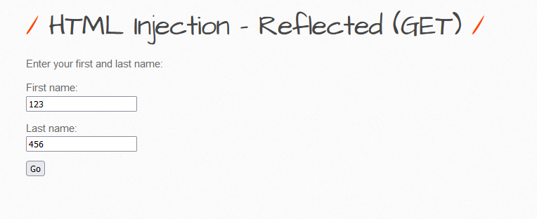
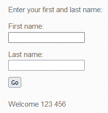
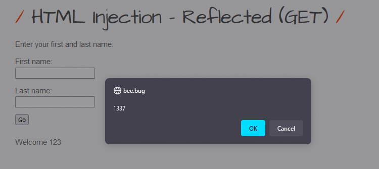
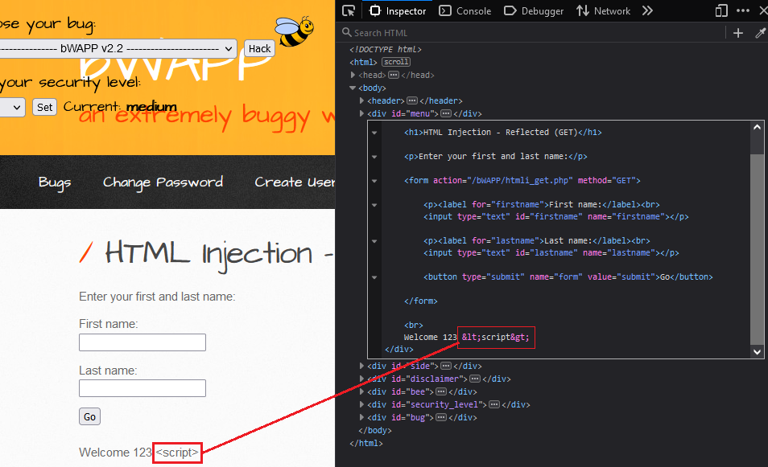
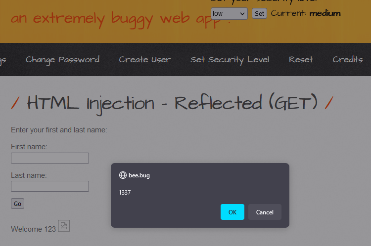

# 1. Low

In the beginning, I found 2 text box: **First name** and **Last name**, So I tried to input some data: 123 & 456 as following picture.

After submit, the data sent to server via `GET` method in following picture:
- `http://bee.bug/bWAPP/htmli_get.php?firstname=123&lastname=456&form=submit`

Server return Welcome **123 456**

I changed `lastname` variable as following link: `http://bee.bug/bWAPP/htmli_get.php?firstname=123&lastname=&form=submit`

And result is:

---
# 2. Medium
In the beginning, I found 2 text box: **First name** and **Last name**, So I tried to input some data: 123 & 456 as following picture.

After submit, the data sent to server via `GET` method in following picture:
- `http://bee.bug/bWAPP/htmli_get.php?firstname=123&lastname=456&form=submit`

Server return Welcome **123 456**

I changed `lastname` variable as following link: `http://bee.bug/bWAPP/htmli_get.php?firstname=123&lastname=%3Cscript%3E&form=submit`

I found that the payload inputted into server is sanitized:

So, I tried to double encode URL as following payload which is encoded `%` into `%25`:
- `%253Cimg%252Fsrc%253D%2522x%2522%252Fonerror%253D%2522confirm%25281337%2529%2522%253E`

And final result:

---
# 3. Remediation

- Validating User Input and only accept word or number only, example given using regular expression: `\w+` or `[a-zA-Z0-9 ]+`
- Using function to filter input: 
	- `$value = htmlentities($_GET['src'], ENT_QUOTES);`
	- `$value = htmlspecialchars($_GET['src'], ENT_QUOTES);`
- Using [sanitize filter php](https://www.php.net/manual/en/filter.filters.sanitize.php)