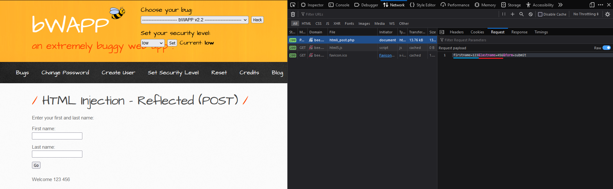
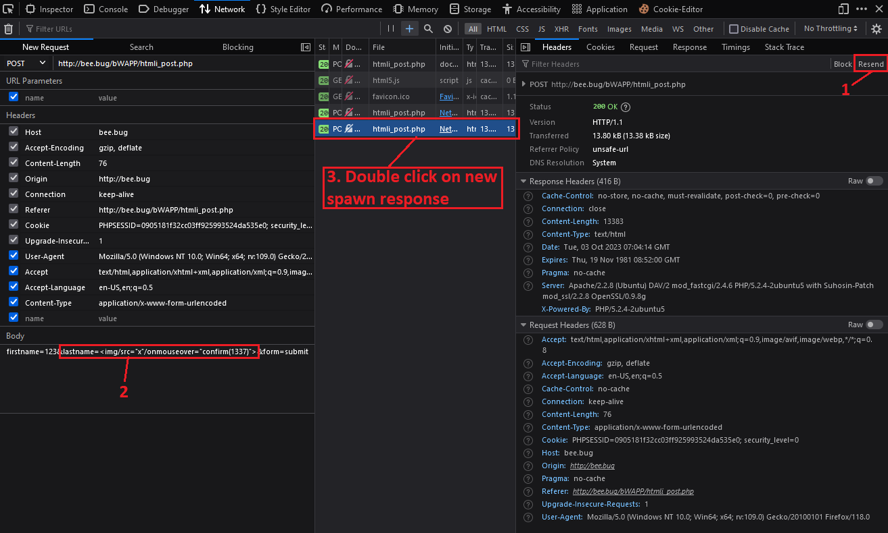
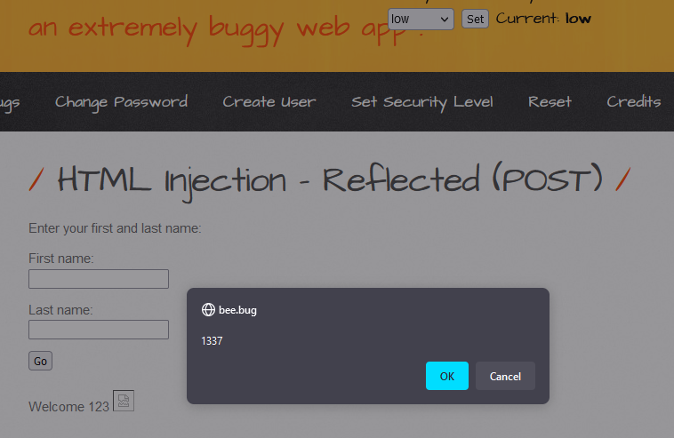
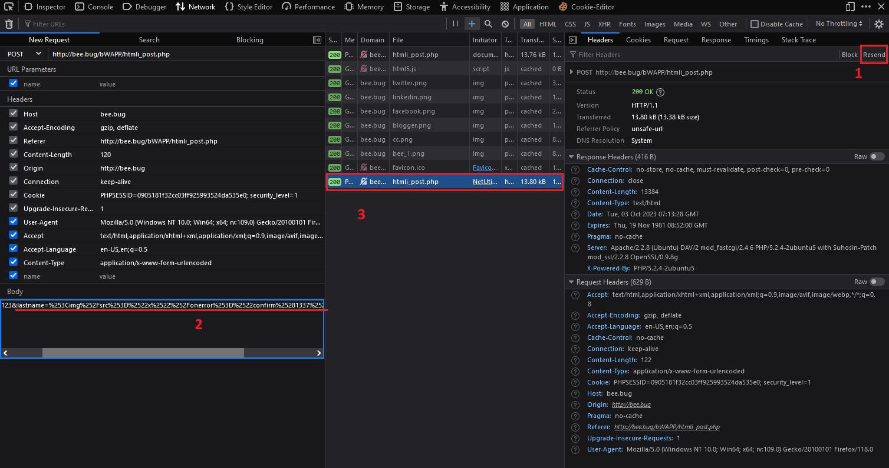
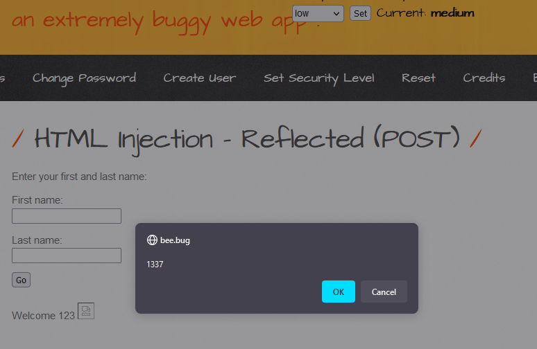

# 1. Low
First look, looked similar with [HTML Injection - Reflected (GET)](HTML%20Injection%20-%20Reflected%20(GET).md). So I am gonna analysis and find out parameters sent by `POST` method.

So, I am going to resend it with old payload which is used in **HTMLi GET** 😛, but changed from `onerror` to `onmouseover` event: ``

And here is the result when moving the mouse over the picture:

---
# 2. Medium

First look, looked similar with [HTML Injection - Reflected (GET)](HTML%20Injection%20-%20Reflected%20(GET).md). So I am gonna analysis and find out parameters sent by `POST` method.

So, I am going to resend it with old payload which is used in **HTMLi GET** 😁, but changed from `onerror` to `onmouseover` event: `%253Cimg%252Fsrc%253D%2522x%2522%252Fonmouseover%253D%2522confirm%25281337%2529%2522%253E`

And here is the result when moving the mouse over the picture:

---
# 3. Remediation

- Validating User Input and only accept word or number only, example given using regular expression: `\w+` or `[a-zA-Z0-9 ]+`
- Using function to filter input: 
	- `$value = htmlentities($_GET['src'], ENT_QUOTES);`
	- `$value = htmlspecialchars($_GET['src'], ENT_QUOTES);`
- Using [sanitize filter php](https://www.php.net/manual/en/filter.filters.sanitize.php)