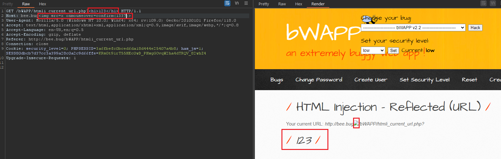
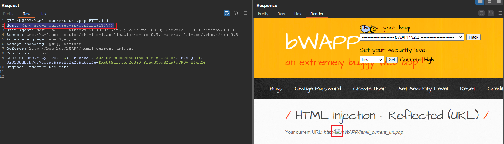

# 1. Low
The server reflected on host name `Host: <data_reflected_here>` and on the path `/bWAPP/htmli_current_url.php<payload>`

---
# 2. High

`Host: `

---
# 3. Remediation

- Validating User Input and only accept word or number only, example given using regular expression: `\w+` or `[a-zA-Z0-9 ]+`
- Using function to filter input: 
	- `$value = htmlentities($_GET['src'], ENT_QUOTES);`
	- `$value = htmlspecialchars($_GET['src'], ENT_QUOTES);`
- Using [sanitize filter php](https://www.php.net/manual/en/filter.filters.sanitize.php)