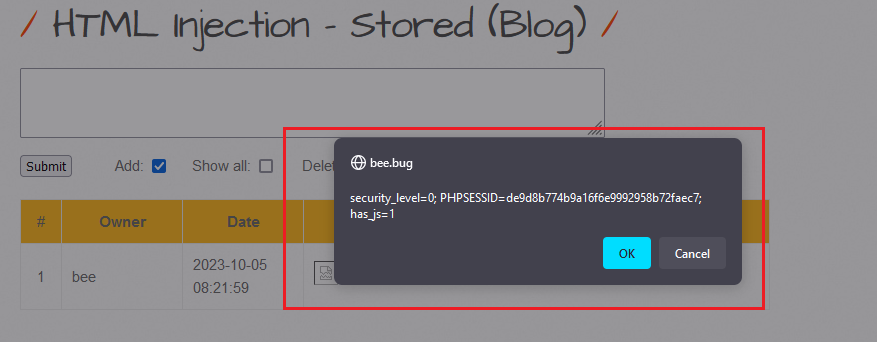

# 1. Low
In this case, I tried default payload: ``

---
# 2. Medium

The server have sanitized almost sensitive cases that could not bypass

---
# 3. Remediation

- Validating User Input and only accept word or number only, example given using regular expression: `\w+` or `[a-zA-Z0-9 ]+`
- Using function to filter input: 
	- `$value = htmlentities($_GET['src'], ENT_QUOTES);`
	- `$value = htmlspecialchars($_GET['src'], ENT_QUOTES);`
- Using [sanitize filter php](https://www.php.net/manual/en/filter.filters.sanitize.php)