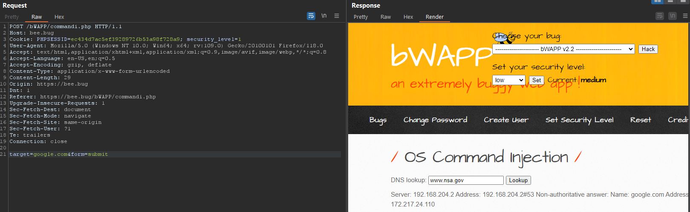
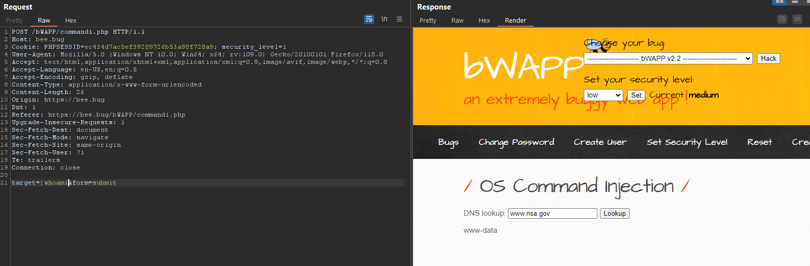

# 1. Low
Running in normally. I can see that the server have the `www.nsa.gov` put into `target` variable

I tried to add `|`which mean [pipelines](https://www.gnu.org/software/bash/manual/html_node/Pipelines.html) to bypass and run my expected command:
- My payload: `| whoami`

---
# 2. Medium
Checking the source code, I could see that in this level, the source code only filtered on `;` and '&' but not `|` so that I used Low payload to bypass

---
# 3. Remediation

- Validating User Input and only accept word or number only, example given using regular expression: `\w+` or `[a-zA-Z0-9 ]+`
- Using function to filter input: 
	- `$value = htmlentities($_GET['src'], ENT_QUOTES);`
	- `$value = htmlspecialchars($_GET['src'], ENT_QUOTES);`
- Using [sanitize filter php](https://www.php.net/manual/en/filter.filters.sanitize.php)