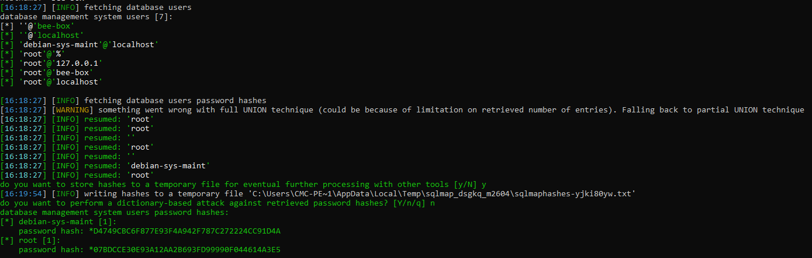
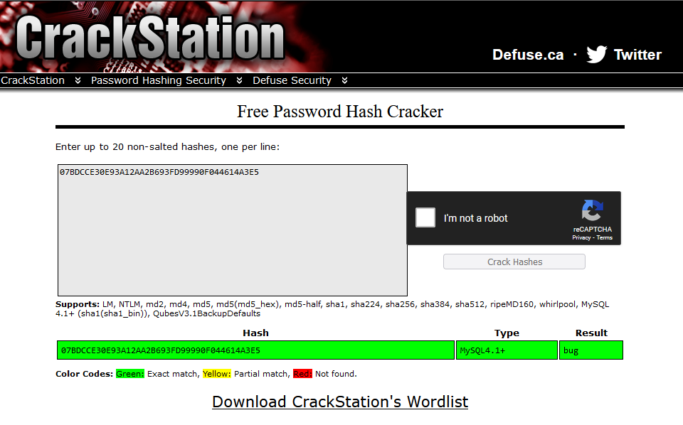

# 1. Low

When putting some text on text box on this challenge. The web page automatically execute and return the result without loading webpage.


Check out on BurpSuite that how it's worked or which API called.


Start input escape quote `'` and the result is similar with [SQL Injection (GET-Search)](SQL%20Injection%20(GET-Search)). Now following those instruction and using SQLMap to exploit for faster.


---
# 2. Medium
There are 2 php file `sqli_10-1.php` and `sqli_10-2.php`:
- On the `sqli_10-1.php` is the frame that showing on UI which you can interact on your browser. If you putting anything inside the box, it the script will request to `sqli_10-2.php`

In `sqli_10-2.php`, the Medium 


Check more what `sqli_check_1()` and `sqli_check_2()` are, those function called `addslashes()` and `mysql_real_escape_string()` which are could not bypass at the moment.


---
# 3. Script Supported
In this case, SQL Injection Techniques has already have [SQLMap](https://sqlmap.org/) which is a powered tool develop in python so that I should not write a script because of not better than [SQLMap](https://sqlmap.org/) 😁
- `sqlmap.py -u http://bee.bug:80/bWAPP/sqli_2.php?movie=1%27&action=go --hostname --tables --users --dbs --passwords --columns --cookie=PHPSESSID=c77d6e1e60e432177d833db76d92d0a9;security_level=0`



We known the credentials in hashes:
```shell
[*] debian-sys-maint [1]:
    password hash: *D4749CBC6F877E93F4A942F787C272224CC91D4A
[*] root [1]:
    password hash: *07BDCCE30E93A12AA2B693FD99990F044614A3E5
```
Trying to use [Crackstation](https://crackstation.net/) to see if we can have cleartext?



And finally, all reports that output in following path: 
- Environment variable path: `%LocalAppData%\sqlmap\output\<host_name_scanned>`
- Shell folder: `shell:Local AppData\sqlmap\output\<host_name_scanned>`

---
# 4. Remediation

- Validating User Input and only accept word or number only, example given using regular expression: `\w+` or `[a-zA-Z0-9 .-_]+`
- Using function to filter input: 
	- `$value = mysql_real_escape_string($data);`
	- `$value = addslashes($data);`
- Using [sanitize filter php](https://www.php.net/manual/en/filter.filters.sanitize.php)