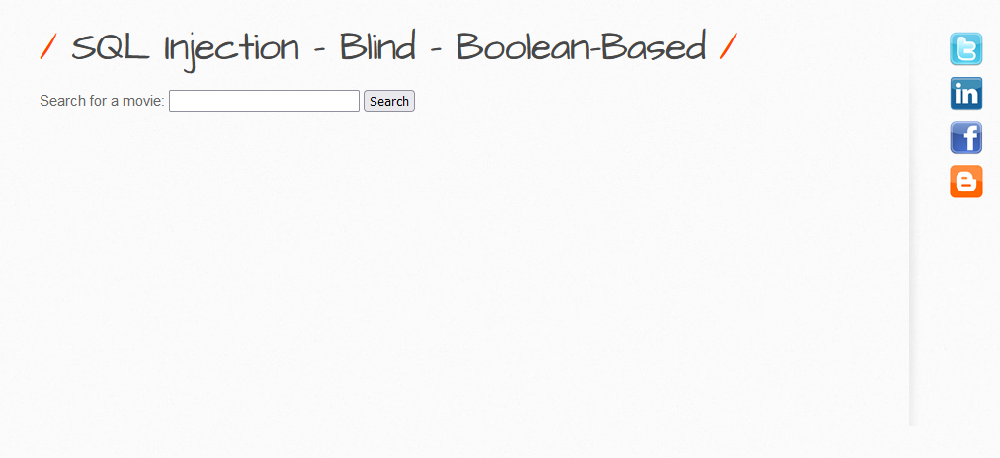
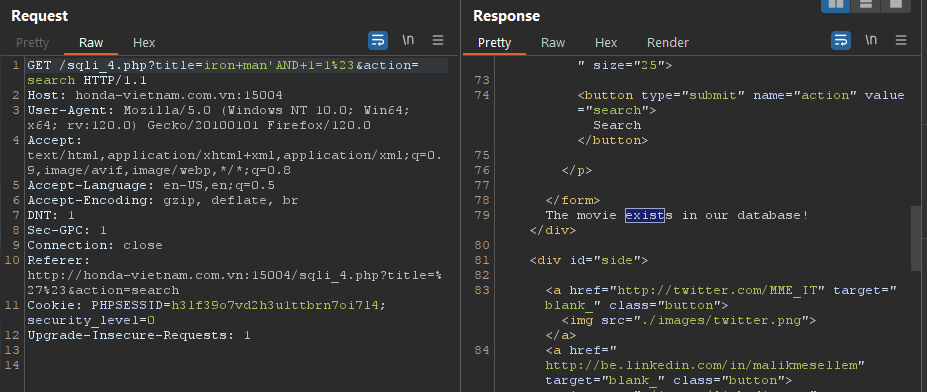
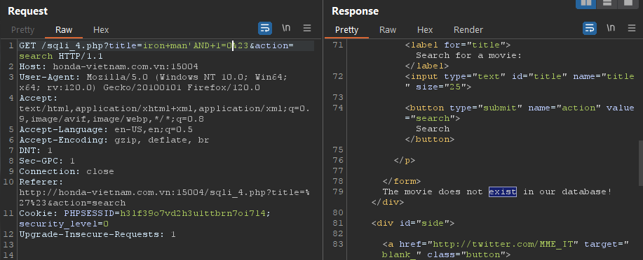
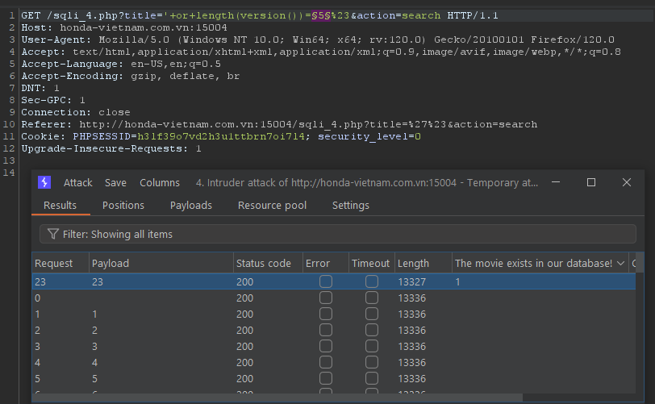
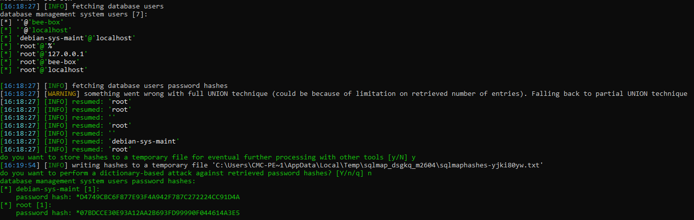
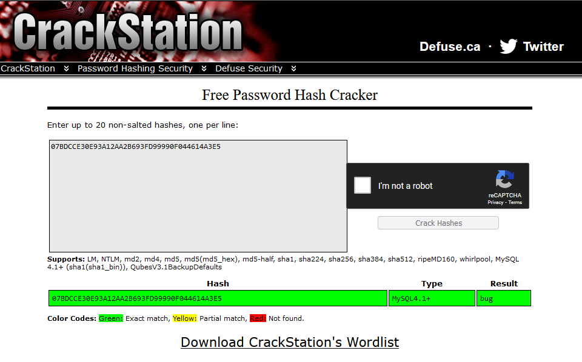

# 1. Low



When inputting Single quote (`'`), the server response with `Incorrect syntax detected!`. Using comment character to make statement correct, I used `'#` and the response was `The movie does not exist in our database!` which mean the query statement correct. Go on BurpSuite and repeat the request.
Using OR statement if return True so that the Backend will returned `The movie exists in our database!`. I'm using this payload: `'OR+1=0%23`, or you can also use AND statement `iron man'AND+1=1%23`.


If the statements return False that it will returned `The movie does not exist in our database!`.



Following up, we can determine the length of data we want to find, then compare each character to find out the exact data we need. For an example, I will determine the length of SQL Version using following payload: `'+or+length(version())=23%23`. In below picture, I used BurpSuite's Intruder to find the length depend on `The movie exists in our database!`



To explore more, you can using SQLMap, or can also build script and make it automation brute forcing

---
# 2. Medium

In the Medium level, the special character has beed added by `addslashes()` function which make from the raw string (E.g: `Is your name O'Reilly?`) to the modified string (E.g: `Is your name O\'Reilly?`). So I could not bypass it.

---
# 3. Script Supported
In this case, SQL Injection Techniques has already have [SQLMap](https://sqlmap.org/) which is a powered tool develop in python so that I should not write a script because of not better than [SQLMap](https://sqlmap.org/) 😁
- `sqlmap.py -u http://bee.bug:80/bWAPP/sqli_2.php?movie=1%27&action=go --hostname --tables --users --dbs --passwords --columns --cookie=PHPSESSID=c77d6e1e60e432177d833db76d92d0a9;security_level=0`



We known the credentials in hashes:
```shell
[*] debian-sys-maint [1]:
    password hash: *D4749CBC6F877E93F4A942F787C272224CC91D4A
[*] root [1]:
    password hash: *07BDCCE30E93A12AA2B693FD99990F044614A3E5
```
Trying to use [Crackstation](https://crackstation.net/) to see if we can have cleartext?



And finally, all reports that output in following path: 
- Environment variable path: `%LocalAppData%\sqlmap\output\<host_name_scanned>`
- Shell folder: `shell:Local AppData\sqlmap\output\<host_name_scanned>`

---
# 4. Remediation

- Validating User Input and only accept word or number only, example given using regular expression: `\w+` or `[a-zA-Z0-9 .-_]+`
- Using function to filter input: 
	- `$value = mysql_real_escape_string($data);`
	- `$value = addslashes($data);`
- Using [sanitize filter php](https://www.php.net/manual/en/filter.filters.sanitize.php)
