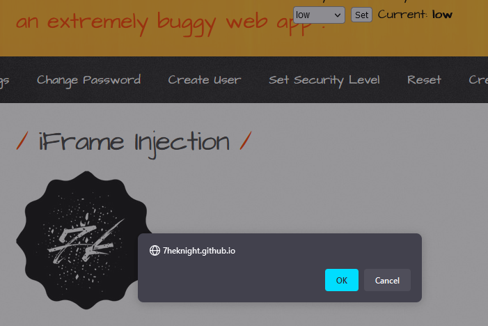

# 1. Low
I determine that the server is loading with the following parameter as below:
- ParamUrl=**robots.txt**&ParamWidth=250&ParamHeight=250
`http://bee.bug/bWAPP/iframei.php?ParamUrl=https://7heknight.github.io/js/2.svg&ParamWidth=250&ParamHeight=250`



---
# 2. Medium
In this case, the `Robots.txt` seem like hardcoded on Server side so that I could not bypass. Using OS Command Injection to get the source code. Like what I suggest that it is Hardcoded.

```php
<?php
if($_COOKIE["security_level"] == "1" || $_COOKIE["security_level"] == "2"){
?> # Medium and High level
    <iframe frameborder="0" src="robots.txt" height="<?php echo xss($_GET["ParamHeight"])?>" width="<?php echo xss($_GET["ParamWidth"])?>"></iframe>
<?php
}

else{ # Low level
?>
<iframe frameborder="0" src="<?php echo xss($_GET["ParamUrl"])?>" height="<?php echo xss($_GET["ParamHeight"])?>" width="<?php echo xss($_GET["ParamWidth"])?>"></iframe>
<?php
}
?>
```

---
# 3. Remediation

- Validating User Input and only accept word or number only, example given using regular expression: `\w+` or `[a-zA-Z0-9 ]+`
- Using [sanitize filter php](https://www.php.net/manual/en/filter.filters.sanitize.php)