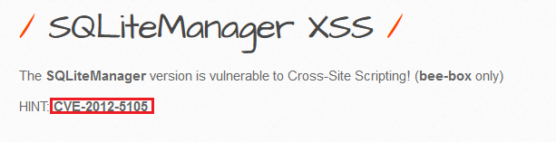
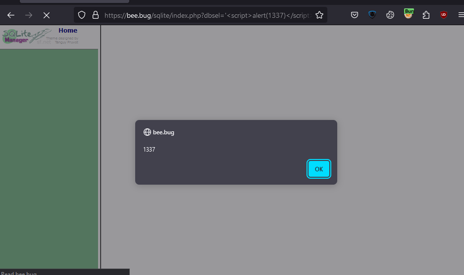
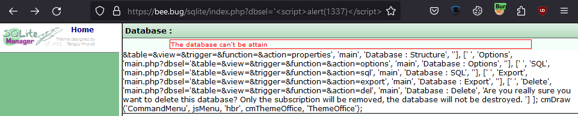

## 1. Scenario

https://exchange.xforce.ibmcloud.com/vulnerabilities/72141

---
## 2. Vulnerability

Following description from **xforce**, I tried with following payload and it's reflected xss on `sqlite/index.php`
- Payload: `dbsel='`

---
