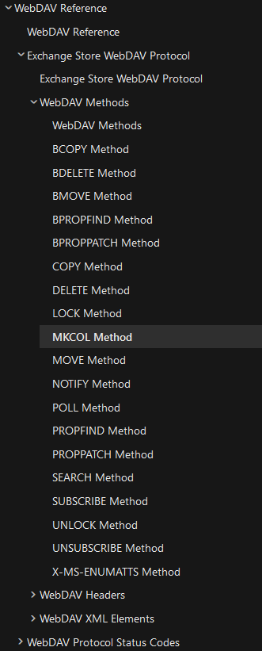

## 1. What is WebDAV
WebDAV (Web Distributed Authoring and Versioning) is a set of extensions to the Hypertext Transfer Protocol (HTTP), which allows user agents to collaboratively author contents directly in an HTTP web server by providing facilities for concurrency control and namespace operations

Following Microsoft defined about [WebDAV](https://learn.microsoft.com/en-us/previous-versions/office/developer/exchange-server-2003/aa142923(v=exchg.65)), We can also known and use following method.

---
## 2. Vulnerability

On first look. the Web page is loaded into `/bWAPP/sm_webdav.php`.

And here is default on API `/WebDAV/`

### 2.1 PUT Method
Trying with PUT method to upload a PHP shell.

After created a file success with PHP `system()` call

### 2.2 DELETE Method

Using `DELETE` Method and success

## 3. Tools help determine and exploit
- davtest

- cadaver

## 4. Prevention
- Disable WebDav
- Restrict Access
